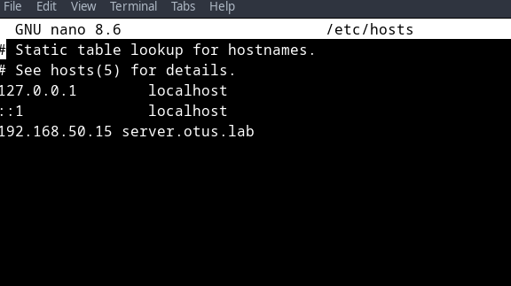
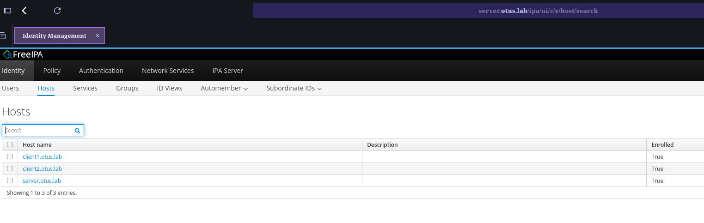
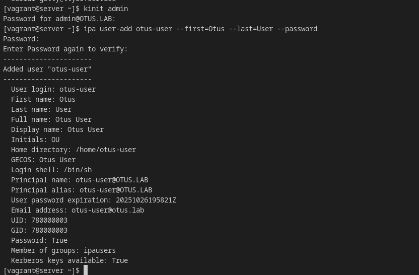
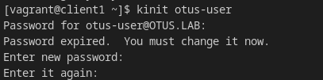
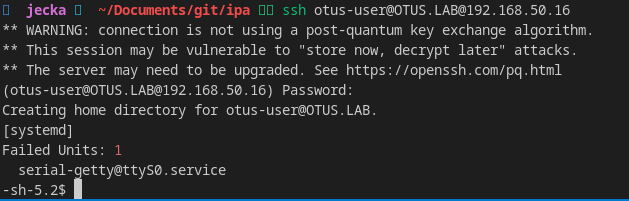

### 38. LDAP. Централизованная авторизация и аутентификация 

#### Задача

Научиться настраивать LDAP-сервер и подключать к нему LDAP-клиентов;

Описание/Пошаговая инструкция выполнения домашнего задания:

Для выполнения домашнего задания используйте методичку


Что нужно сделать?

    Установить FreeIPA
    Написать Ansible-playbook для конфигурации клиента

Дополнительное задание
3)* Настроить аутентификацию по SSH-ключам
4)** Firewall должен быть включен на сервере и на клиенте


#### Решение

1)  Необязательно. Скачиваем новый box c OS Fedora c оффициального сайта.

```bash
wget https://download.fedoraproject.org/pub/fedora/linux/releases/42/Cloud/x86_64/images/Fedora-Cloud-Base-Vagrant-VirtualBox-42-1.1.x86_64.vagrant.virtualbox.box
```

1.1)  Импорт box в Vagrant

```bash
vagrant box add --name Fedora  /path_to_download_boxfile/Fedora-Cloud-Base-Vagrant-VirtualBox-42-1.1.x86_64.vagrant.virtualbox.box
```

После действий выше мы можем использовать данный образ в Vagrant - Имя Fedora

2) Для развртывния IPA сервера мы предварительно разворачиваем 3 виртуальные машины

a) server - ["192.168.57.2",  2, "255.255.255.0",  "ipa"],
                    ["192.168.50.15",  8, "255.255.255.0"],

b) client1 - ["192.168.57.3",  2, "255.255.255.0",  "ipa"],
                  ["192.168.50.16",  8, "255.255.255.0"],
                  
c) client2 -["192.168.57.4",  2, "255.255.255.0",  "ipa"],
                  ["192.168.50.17",  8, "255.255.255.0"],


2.1) После производим настройку  файла Hosts для сервера
2.2)  Производим установку необходимых пактов прогрммного обеспечения 
2.3)  Производим саму инсталляцию IPA сервера

```bash
ipa-server-install --setup-dns --forwarder=8.8.8.8 --auto-reverse --hostname=$(hostname -f)  --netbios-name="OTUSLAB" --no-ntp --domain="otus.lab" --realm="OTUS.LAB" --admin-password={{ admin_password }}  --ds-password={{ directory_service_password }} -U --skip-mem-check
```
Где:
--setup-dns - установка DNS сервера
--forwarder=8.8.8.8  - в качестве форведеров настраивается DNS сервер 8.8.8.8
--auto-reverse - создавать записи обратной зоны
--hostname=$(hostname -f) -в качестве имени сервера указать свое имя
--netbios-name="OTUSLAB" - Netbios имя
--no-ntp - не настриватать Ntp сервера chrony  установлен 
--domain="otus.lab" -имя домена
--realm="OTUS.LAB" - область управления
--admin-password={{ admin_password }} - пароль админстратора домена
--ds-password={{ directory_service_password }} -  пароль службы DS
-U - не использовать интерактивынй режим
-skip-mem-check - не проверять обьем оперативной памяти  (так как у нас тестовое развертывние )

3) Установка клиеентов
3.1) Мы в качестве DNS серверов укзываме наш доменный сервер
3.2) Производин настройку файла hosts
3.3) Производим скачивание необходимых пакетов
3.4) Производим установку пакета позволяющего подключить ПК в домен

```bash
  ipa-client-install  -U -p admin -w {{ admin_password }}  --domain="otus.lab" --server="server.otus.lab" --realm="OTUS.LAB" --mkhomedir
```
 Где:
-U -неинтерактивный режим
-p admin - имя пользователя от которого производится подключение ПК в домен
-w {{ admin_password }} -пароль учетной записи
--domain="otus.lab" - домен к которому происходит подключение
--server="server.otus.lab" -имя сервера с помощью которого происходит подключение к домену
--realm="OTUS.LAB" -Область управления
--mkhomedir - создание домашних директорий пользователей

После проведенных мероприятий мы получем развернутый IPA сервер управляющий доменом Otus.lab, а так же 2 рабочх станций подключенных в домен.

Для проверки  доступности веб управления доменом мы на нашей хостовой машине должны занести в файл /etc/hosts информацию о нашем сервере



После этого мы сможем открыть Веб консоль управления домен и авторизоваться там с логином admin  и паролем который был указан при установке
И на вкладке Computers -  увидис все наши ПК находящиеся в домене



Создадим пользователя в домене 


При попытке зайти на клиенете под созданным пользователм , нас попросят сменить первичный пароль от учетной записи


Далее мы можем подключиться к ПК под созданным пользователм.


